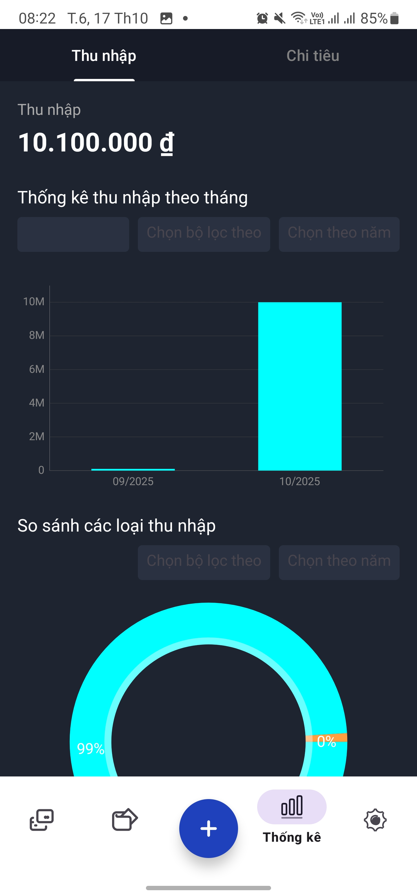
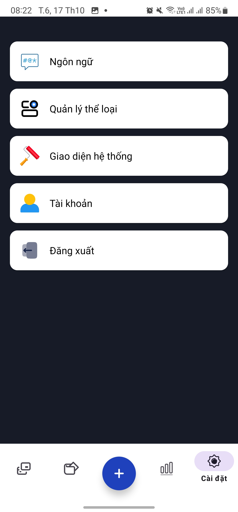

# MoneyManagement---BT-Basic-Android

## 1. Contributor
- [Phan An Phúc](https://github.com/anphuc2005)
## 2. Introduction
- Money Management App is an intuitive and efficient application designed to help users manage their personal finances with ease and clarity. Key features include:

    - **A clean and optimized interface**, providing a smooth user experience that makes tracking income, expenses, and budgets simple for everyone.

    - **Comprehensive financial insights**, offering detailed analytics and visual reports to help users make informed financial decisions.

    - **Smart transaction management**, allowing quick additions, edits, and categorization of expenses anytime, anywhere.

    - **Personalized financial tracking**, enabling each user to set goals, monitor savings, and review their spending history to build better financial habits.

## 3. Working Model
- I operate according to the **Scrum** model, using Linear to manage task. All tasks are thoroughly kept track on Linear.
  - Link Linear: [Linear] (https://linear.app/btck-android/team/BTC/active)
- Each week, team will have a meeting to review completed tasks, tackle any remaining problems and propose solutions for the following week.

## Version Control Strategy
- Team uses **Gitflow** to manage code. Each member will create a branch from `develop` to work on, naming the branches in the format `feature/function-name`.

- Once completing a branch, team will create a Pull Request to review code as well as merge it into develop.

    - Main branches:
        - `master`: Contains stable code which has been thoroughly tested and reviewed.
        - `develop`: Contains latest code going through the test and review process.
        - `feature/`: Contains ongoing development code, which are short-lived and will be merged into develop once completing.

At the end of each week, team will merge develop into main/master to release a new version.

## 4. Technolegies
- Language: Kotlin
- Development Platform: Android
- Firebase (Firebase Authentication, Firebase Realtime Database, Firebase BOM)
- Glide
- Recycler View, Adapter
- Kotlin Coroutines
- MP Android Chart

## 5. Demo App
- Link download: [APK](https://drive.google.com/file/d/1YgFwKXB78pUL-NdwGpRbo1a9weIesqwg/view?usp=sharing)
- **Welcome**, **Sign In**, **Sign Up** and **Forgot password**

  
  
  
  

- **Home Screen**, **Wallet Screen**, **Statistical Screen** and **Setting Screen**

  
  
  
  
  

- **Language Screen**, **Type Management Screen**, **Account Screen**

  
  
  
  
  

## 6. References
- [Kotlin Documentation](https://kotlinlang.org/docs/home.html)
- [Android Documentation](https://developer.android.com/reference/org/w3c/dom/Document)
- [Firebase Documentation](https://firebase.google.com/docs)
- [Firebase Realtime Database](https://firebase.google.com/docs/database?hl=vi)
- [Firebase Authentication Documentation](https://firebase.google.com/docs/auth)